# Image Watermarking (LSB Method)

This project implements a simple **spatial domain watermarking** technique on a face photo. The goal is to understand the fundamentals of digital watermarking: how to hide information inside an image, and what happens to that hidden information when the image gets compressed.

---

## Method: Least Significant Bit (LSB) Substitution

The idea behind LSB watermarking is straightforward. Every pixel in a digital image is stored as an 8-bit integer (0 to 255). Out of those 8 bits, the last one (bit 0) only contributes a difference of 1 gray level, practically invisible to the human eye. So we can replace that last bit with our watermark data without visually changing the image.

**Embedding formula:**
```
watermarked_pixel = (original_pixel & 0xFE) | watermark_bit
```

`0xFE` in binary is `11111110`, so `& 0xFE` just clears the last bit. Then `| watermark_bit` sets it to whatever the watermark says (0 or 1).

**Extraction is even simpler:**
```
extracted_bit = pixel & 0x01
```

Just read the last bit of each pixel. That's it.

For this experiment, the watermark is a **64×64 random binary pattern** generated with a fixed seed. It gets embedded into the red channel of the top-left 64×64 pixel region of the cover image.

---

## The Watermark

The watermark itself is a random black-and-white noise pattern:

<p align="center">
  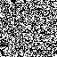
  <br/>
  <em>Original 64×64 binary watermark (seed=42)</em>
</p>

It looks like random noise, which is intentional. A random pattern is harder to spot or fake compared to something structured like a logo.

---

## Cover Image

The watermark is embedded into this photo:

<p align="center">
  
  <br/>
  <em>Cover image — 1280×960 px</em>
</p>

Because the cover image is 1280×960 and the watermark is only 64×64, the embedded region covers only the very top-left corner. Visually, there is zero difference between the original and watermarked version.

---

## Evaluating Robustness Against JPEG Compression

After embedding, the watermarked image is saved as JPEG at 10 different quality factors: 100, 90, 80, 70, 60, 50, 40, 30, 20, and 10. For each, we extract the watermark back out and measure the **Bit Error Rate (BER)**, how many extracted bits are wrong compared to the original watermark.

- BER = 0.0 means perfect extraction, every bit is correct
- BER = 0.5 means the extracted data is pure random noise, completely unrelated to the watermark

### Results

| QF | BER | Status |
|:---:|:---:|:---:|
| 100 | 0.4038 | Degraded |
| 90 | 0.4973 | Destroyed |
| 80 | 0.4995 | Destroyed |
| 70 | 0.4929 | Destroyed |
| 60 | 0.5046 | Destroyed |
| 50 | 0.4897 | Destroyed |
| 40 | 0.5056 | Destroyed |
| 30 | 0.5022 | Destroyed |
| 20 | 0.4968 | Destroyed |
| 10 | 0.4980 | Destroyed |

<p align="center">
  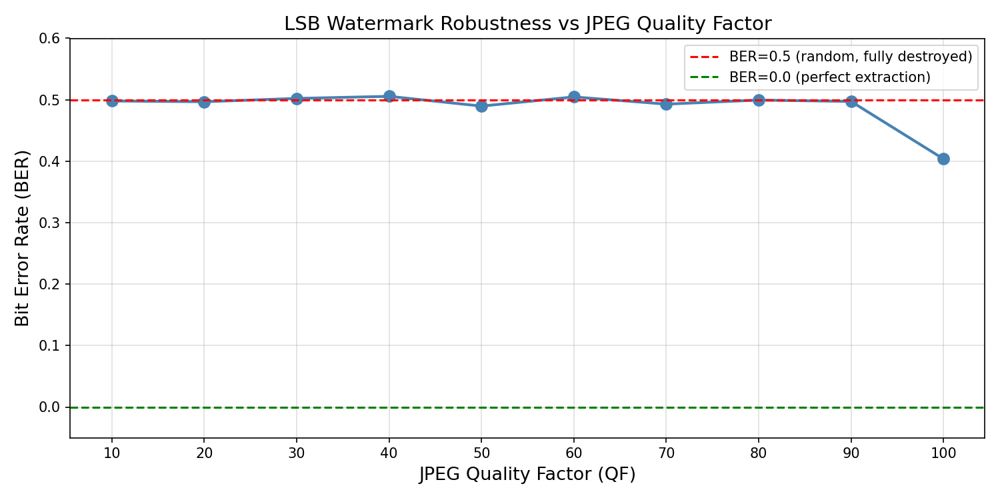
</p>

The drop at QF=100 is the only point where BER falls below 0.5, and even then it sits at 0.40, meaning 4 out of 10 bits are already wrong. At every other quality factor from 90 downward, BER hovers right at 0.5, which is indistinguishable from random noise.

**The watermark becomes unextractable starting at QF = 90.**

---

## Visual Comparison of Extracted Watermarks

All extracted watermarks compared side-by-side against the original:

<table align="center">
  <tr>
    <td align="center">
      <br/>
      <em><b>Original</b></em>
    </td>
    <td align="center">
      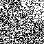<br/>
      <em>QF=100</em><br/>
      <em>BER=0.4038</em>
    </td>
    <td align="center">
      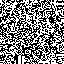<br/>
      <em>QF=90</em><br/>
      <em>BER=0.4973</em>
    </td>
    <td align="center">
      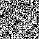<br/>
      <em>QF=80</em><br/>
      <em>BER=0.4995</em>
    </td>
    <td align="center">
      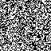<br/>
      <em>QF=70</em><br/>
      <em>BER=0.4929</em>
    </td>
    <td align="center">
      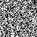<br/>
      <em>QF=60</em><br/>
      <em>BER=0.5046</em>
    </td>
  </tr>
  <tr>
    <td align="center" colspan="6"><br/></td>
  </tr>
  <tr>
    <td align="center">
      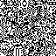<br/>
      <em>QF=50</em><br/>
      <em>BER=0.4897</em>
    </td>
    <td align="center">
      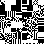<br/>
      <em>QF=40</em><br/>
      <em>BER=0.5056</em>
    </td>
    <td align="center">
      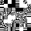<br/>
      <em>QF=30</em><br/>
      <em>BER=0.5022</em>
    </td>
    <td align="center">
      <br/>
      <em>QF=20</em><br/>
      <em>BER=0.4968</em>
    </td>
    <td align="center">
      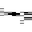<br/>
      <em>QF=10</em><br/>
      <em>BER=0.4980</em>
    </td>
    <td></td>
  </tr>
</table>

At QF=100, the extracted image *looks* similar to the original visually, both appear as random noise. But the BER of 0.40 tells a different story. Random noise tends to look like random noise regardless of whether it matches the original or not, so visual inspection is misleading here. BER is the right tool for measuring this.

From QF=90 downward, BER locks at ≈ 0.50 across all quality factors, statistically identical to flipping a coin, meaning the watermark carries zero recoverable information. At QF=10, the extracted pattern shows horizontal streaks rather than random noise because heavy JPEG block artifacts imprint a structured low-frequency signature onto the LSBs.

---

## Watermarked Images at Each Quality Factor

The same selfie saved as JPEG at each quality factor after watermark embedding. Notice how the photo degrades visually as QF drops, while the watermark was already destroyed long before the image looks bad.

<table align="center">
  <tr>
    <td align="center">
      <br/>
      <em>QF=100</em>
    </td>
    <td align="center">
      <br/>
      <em>QF=90</em>
    </td>
    <td align="center">
      <br/>
      <em>QF=80</em>
    </td>
    <td align="center">
      <br/>
      <em>QF=70</em>
    </td>
    <td align="center">
      <br/>
      <em>QF=60</em>
    </td>
  </tr>
  <tr>
    <td align="center">
      <br/>
      <em>QF=50</em>
    </td>
    <td align="center">
      <br/>
      <em>QF=40</em>
    </td>
    <td align="center">
      <br/>
      <em>QF=30</em>
    </td>
    <td align="center">
      <br/>
      <em>QF=20</em>
    </td>
    <td align="center">
      <br/>
      <em>QF=10</em>
    </td>
  </tr>
</table>

## Why LSB Fails Under JPEG

JPEG compression works in three steps: it converts the image to frequency domain using DCT (Discrete Cosine Transform), quantizes (rounds) the frequency coefficients, then converts back. This rounding process changes pixel values, and since LSBs are the least significant part of those values, they are the first thing to get corrupted.

Even at the maximum quality factor (QF=100), JPEG is still lossy, it still rounds some coefficients, which still flips some LSBs. The watermark starts degrading the moment you save to JPEG, long before you touch a lower quality setting.

This is why LSB is described as a **fragile watermarking** scheme. It is not designed to survive compression at all. It is the simplest possible way to embed data invisibly, which makes it a good starting point to learn the concept, but not practical for real-world use where images typically get re-compressed multiple times.

---

## Files

```
image.jpeg               cover image
watermark.py             the main script
results/
  watermark_original.png     the 64x64 watermark we embedded
  watermarked_lossless.png   watermarked image (no compression, for reference)
  watermarked_qfXX.jpg       watermarked image saved at each JPEG quality factor
  extracted_qfXX.png         watermark extracted from each compressed file
  ber_vs_qf.png              BER plot across all quality factors
```
